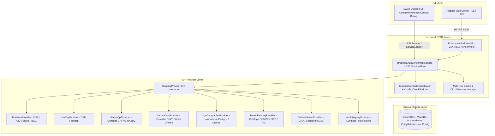

# ARQUITETURA DO SUBSISTEMA DE ENRIQUECIMENTO DE DADOS CADASTRAIS BRASILEIROS (BR-LAWYER)

**Documento de Arquitetura Técnica de Referência**  
**Versão:** 1.0.0  
**Status:** Aprovado para Implementação  

---

## 1. VISÃO GERAL

O subsistema de **Enriquecimento de Dados Cadastrais Brasileiros** do **BR-LAWYER** é uma camada corporativa extensível projetada para transformar cadastros manuais em um ecossistema inteligente de preenchimento, validação, descoberta, desambiguação relacional (QSA) e prevenção de conflitos de interesse (*conflict check*).

O subsistema opera integrado à arquitetura do j-lawyer / BR-LAWYER (EJB 3.x / JPA / WildFly / REST / Swing Desktop / Angular Web) preservando os princípios de:
1. **Self-hosting e Open Source:** Operação autônoma sem dependência mandatória de serviços proprietários externos pagos.
2. **Desacoplamento por SPI (Service Provider Interface):** O domínio interno interage exclusivamente com modelos canônicos e interfaces agnósticas de provedor.
3. **Resiliência e Continuidade Operacional:** Circuit Breaker, Exponential Backoff, cache com TTL, e fallback em cascata. Falhas de rede nunca travam ou impedem o cadastro manual.
4. **Governança e Proveniência (Lineage):** Registro da fonte, data da consulta, status de cache e rastreabilidade por campo.
5. **Segurança e LGPD:** Tratamento legítimo (art. 7º, incisos II, V, VI, IX, XII e art. 11, II, "d" da Lei 13.709/2018) com proteção criptográfica de credenciais e sanitização de logs.

---

## 2. DIAGRAMA DA ARQUITETURA DE CAMADAS

---

## 3. MODELOS CANÔNICOS NORMALIZADOS

O domínio do BR-LAWYER não manipula JSONs de fornecedores externos. As respostas são convertidas para estruturas canônicas:

1. **`CompanyRegistryResult`:**
   - CNPJ (formatado e dígitos puros)
   - Razão Social e Nome Fantasia
   - Situação Cadastral (ATIVA, BAIXADA, INAPTA, SUSPENSA, NULA), Data e Motivo
   - Natureza Jurídica (Código CONCLA e Descrição)
   - Porte (ME, EPP, Demais) e Tipo (Matriz / Filial)
   - Capital Social (BigDecimal)
   - CNAE Fiscal Principal e Lista de CNAEs Secundários
   - Regime Tributário: Opção Simples Nacional e MEI (SIMEI)
   - Endereço Completo (`AddressResult`) com Código IBGE de 7 dígitos
   - Telefones, Emails e Situação Especial
   - Quadro de Sócios e Administradores (QSA - `List<CompanyMemberResult>`)
   - Metadados de Proveniência (`RegistryProvenance`)

2. **`PersonRegistryResult`:**
   - CPF (formatado e dígitos puros)
   - Nome Completo e Nome Social
   - Data de Nascimento (LocalDate)
   - Situação Cadastral (REGULAR, PENDENTE_DE_REGULARIZACAO, SUSPENSA, CANCELADA, TITULAR_FALECIDO, NULA)
   - Data da Situação e Dígito Verificador
   - Proveniência (`RegistryProvenance`)

3. **`AddressResult`:**
   - CEP, Logradouro, Complemento, Bairro, Município, UF
   - Código IBGE do Município (7 dígitos)
   - Coordenadas Geográficas (Latitude/Longitude quando disponíveis)
   - Código SIAFI e DDD
   - Proveniência (`RegistryProvenance`)

4. **`CompanyMemberResult` (QSA):**
   - Nome do Sócio / Administrador
   - CPF/CNPJ (descaracterizado/mascarado conforme LGPD)
   - Qualificação do Sócio (Código RFB e Descrição: Sócio-Administrador, Administrador, Diretor, Presidente, etc.)
   - Faixa Etária e Data de Entrada na Sociedade
   - Representante Legal (Nome, CPF e Qualificação)
   - País de Origem

5. **`ProfessionalRegistrationResult` (OAB):**
   - Número de Inscrição OAB
   - UF / Seccional
   - Tipo (ADVOGADO, ESTAGIARIO, SUPLEMENTAR)
   - Situação (REGULAR, SUSPENSA, CANCELADA, LICENCIADO)
   - Nome Completo e Subseção

6. **`BankingInstitutionResult`:**
   - Código COMPE (3 dígitos, ex: 001, 104, 237, 341)
   - Código ISPB (8 dígitos)
   - Nome Reduzido e Razão Social Completa
   - Indicador de Participante do PIX (boolean)

7. **`RegistryProvenance`:**
   - `providerId` e `providerName`
   - `sourceDescription`
   - `consultedAt` (Instant)
   - `cached` (boolean) e `cacheAgeSeconds`
   - `confidenceScore` (0.0 a 1.0)
   - `fieldProvenanceMap` (`Map<String, RegistryFieldProvenance>`)

---

## 4. RELACIONAMENTOS DE ENTIDADES & QUADRO SOCIETÁRIO (QSA)

Quando uma consulta de CNPJ retorna sócios e administradores:
1. O usuário visualiza o preview do QSA em tabela interativa com caixas de seleção.
2. Ao confirmar, o BR-LAWYER permite importar os sócios selecionados como contatos relacionados (`AddressBean` vinculado).
3. O sistema cria registros formais de `EntityRelationship` com tipos padronizados:
   - `SOCIO_DE`
   - `ADMINISTRADOR_DE`
   - `REPRESENTANTE_LEGAL_DE`
   - `FILIAL_DE`
   - `MATRIZ_DE`
   - `PARTE_CONTRARIA`
   - `ADVOGADO_DE`

---

## 5. DEDUPLICAÇÃO INTELIGENTE & CONFLICT CHECK

### 5.1 Pipeline de Deduplicação
Antes de persistir um novo contato ou aplicar alterações de provedor externo:
1. **Match Exato por Documento:** Verificação de CPF ou CNPJ idêntico (após sanitização).
2. **Match Exato por Nome Normalizado:** Verificação do nome após remoção de acentos e stopwords empresariais.
3. **Match Forte por Similaridade Fonética e Jaro-Winkler:** Score $> 0.88$ indicando provável duplicidade.
4. **Match Possível:** Score entre $0.75$ e $0.88$, sugerindo revisão humana com diff visual (*Merge / Manter Atual / Criar Novo*).

### 5.2 Conflict Check Avançado
O verificador de conflitos do BR-LAWYER cruza:
- Razão Social, Nome Fantasia, Nomes Anteriores e Aliases
- CNPJ e CPF de todos os sócios e administradores do QSA
- Empresas controladas, matriz e filiais
- Partes contrárias ativas em todos os processos vinculados (`ArchiveFileAddressesBean`)
- Classificação: **MATCH EXATO**, **MATCH FORTE**, **POSSÍVEL MATCH**, **SEM CONFLITO**.

---

## 6. SEGURANÇA, LGPD E GOVERNANÇA

1. **Minimização de Dados:** Apenas os campos necessários para qualificação processual, faturamento e cumprimento de dever legal são persistidos.
2. **Proteção de Segredos:** Tokens OAuth2, chaves de API e certificados são armazenados exclusivamente no backend (com criptografia AES).
3. **Auditoria Cadastral:** Registro de eventos estruturados:
   - `COMPANY_LOOKUP`
   - `PERSON_LOOKUP`
   - `ADDRESS_LOOKUP`
   - `REGISTRY_DATA_APPLIED`
   - `CONTACT_RELATION_IMPORTED`
   - `EXTERNAL_DATA_REFRESHED`
4. **Sanitização de Logs:** Nenhum segredo, senha ou token Bearer é gravado em logs.
