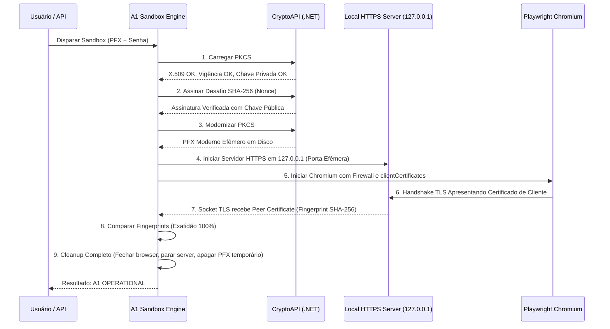

# MOTOR A1 CERTIFICATE SANDBOX
## Validação Determinística mTLS, Assinatura Criptográfica e Compatibilidade ICP-Brasil

O **A1 Certificate Sandbox** do ATRIUM é um ambiente de testes local totalmente isolado, projetado para comprovar a validade operacional de certificados digitais padrão ICP-Brasil sem depender de conexões com tribunais externos.

---

## 🔬 O Pipeline em 9 Etapas

---

## 🛡️ Solução da Incompatibilidade ICP-Brasil x OpenSSL 3 / Chromium

### O Desafio
Os certificados A1 brasileiros emitidos por autoridades certificadoras (ex: SafeWeb, Certisign, Serpro, Valid) utilizam algoritmos de encriptação legados no contêiner PKCS#12 (como RC2-40-CBC ou 3DES). O Node.js 18+ e o Chromium recente (baseados no OpenSSL 3.0) rejeitam tais contêineres diretamente com o erro:
`Unsupported TLS certificate. Most likely, the security algorithm of the given certificate was deprecated by OpenSSL.`

### A Solução do Atrium
1. O Atrium lê o certificado A1 original através das APIs nativas do Windows (`System.Security.Cryptography.X509Certificates.X509Certificate2`) em memória.
2. Assina o nonce de desafio criptográfico para garantir posse e validade da chave privada.
3. Exporta uma versão modernizada temporária do PFX em formato seguro e compatível com OpenSSL 3.
4. O Playwright consome este contêiner temporário durante a conexão mTLS.
5. Ao término do handshake, o arquivo temporário é imediatamente excluído do disco em bloco `try...finally`.
