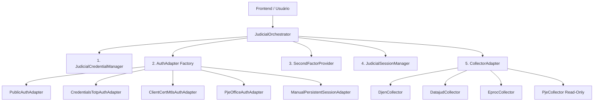

# ARQUITETURA DE INTEGRAÇÃO E AUTENTICAÇÃO JUDICIAL
## ATRIUM — Sistema Integrado de Autenticação e Coleta

Este documento estabelece as diretrizes arquiteturais, separação de responsabilidades e padrões de segurança para a integração com tribunais e sistemas judiciais (eproc, PJe, Projudi, Esaj, DJEN e DataJud).

---

## 🏛️ As 5 Camadas Arquiteturais Independentes

### 1. `JudicialCredentialManager`
- **Responsabilidade**: Gestão e persistência segura de certificados digitais A1 (.PFX/.P12), senhas, credenciais de tribunais e segredos TOTP.
- **Segurança**: Armazenamento em repouso com AES-256-GCM derivado por Scrypt (`data/judicial-integrations.json`).
- **Princípio Zero Trust**: O frontend recebe exclusivamente visões públicas higienizadas (metadados mascarados: titular, CPF truncado, emissor, vigência). Senhas, binários de certificados, chaves privadas e segredos TOTP jamais trafegam na API.

### 2. `AuthAdapter`
- **Responsabilidade**: Estratégias formais de autenticação encapsuladas e desacopladas dos coletores de dados:
  - `public`: Sem autenticação (APIs públicas do DJEN e DataJud).
  - `credentials-totp`: Login com usuário + senha + 2FA com detecção de CAPTCHA (`HUMAN_ACTION_REQUIRED`).
  - `totp` e `username-password-plus-totp`: Estratégias explícitas que não confundem a presença do segundo fator com outras credenciais.
  - `client-cert-mtls`: Apresentação direta de certificado digital de cliente via TLS handshake.
  - `pjeoffice-local`: Interação local via socket loopback com o aplicativo PJeOffice Pro (`127.0.0.1:8800`).
  - `windows-store`: Certificado fornecido pelo repositório do Windows, separado do PFX cifrado.
  - `interactive-human-required`: Intervenção explícita sem bypass de CAPTCHA ou consentimento.
  - `manual-persistent-session`: Navegador assistido interativo para primeiro login humano e captura de sessão persistente.

### 3. `SecondFactorProvider` (TOTP Sandbox)
- **Responsabilidade**: Geração em memória e validação de códigos RFC 6238.
- **Compatibilidade**: Suporte a QR Codes de ativação de tribunais, payloads de exportação do Google Authenticator (`otpauth-migration://`) e chaves manuais Base32.
- **Proteção**: Descarte imediato das imagens de QR após a decodificação em memória.

### 4. `JudicialSessionManager`
- **Responsabilidade**: Ciclo de vida das sessões nos portais judiciais.
- **Isolamento de Perfis**: Perfis de navegador persistentes isolados por usuário, identidade judicial e portal (`data/browser-profiles/<user-id>/<identity-id>/<portal-id>`), com fallback controlado para o perfil primário legado.
- **Locks de Concorrência**: Prevenção de conflito de múltiplos processos acessando simultaneamente a mesma pasta de perfil do Chromium.
- **Taxonomia de Status**: `not_configured`, `authenticating`, `connected`, `action_required`, `expired`, `error`.

### 5. `CollectorAdapter`
- **Responsabilidade**: Coleta supervisionada e estruturação de expedientes, intimações e acervo, com cadência conservadora e backoff.
- **Proteção Read-Only**: Bloqueio rigoroso de ações processuais ativas no PJe/eproc (dar ciência, peticionar, assinar).

---

## 🔒 Tabela de Códigos de Erro Padronizados

| Código | Descrição | Ação Recomendada |
|---|---|---|
| `A1-001` | Certificado não configurado | Selecionar arquivo .pfx nas configurações |
| `A1-002` | Arquivo PFX não encontrado | Verificar permissão ou regravar certificado |
| `A1-003` | Senha do PFX incorreta | Digitar novamente a senha do certificado |
| `A1-006` | Certificado ainda não vigente | Verificar data do relógio do sistema |
| `A1-007` | Certificado digital expirado | Renovar o certificado digital A1 |
| `A1-105` | Certificado não recebido em mTLS | Verificar suporte a cliente TLS |
| `TOTP-001` | Segredo TOTP ausente | Configurar 2FA para o tribunal |
| `TOTP-002` | Segredo Base32 inválido | Informar chave Base32 válida |
| `TOTP-006` | Relógio do sistema desajustado | Sincronizar data e hora do Windows |
| `PJE-001` | PJeOffice Pro indisponível | Iniciar o aplicativo PJeOffice Pro |
| `AUTH-CAPTCHA` | CAPTCHA detectado | Realizar acesso manual assistido |
