# ATRIUM Concepts & Product Patterns to Import

> **Referência Conceitual:** ATRIUM Legal Practice Framework & Modern Legal Tech Principles  
> **Destino:** Arquitetura BR-LAWYER (Swing Desktop & Web UI)  
> **Versão:** 1.0.0

---

## 1. Padrões de Layout e Ergonomia Operacional

O trabalho em escritórios de advocacia e departamentos jurídicos no Brasil é caracterizado pelo processamento diário de centenas de intimações, acompanhamento de centenas a milhares de processos ativos e prazos processuais fatais perenes. Telas meramente cadastrais ou dashboards genéricos resultam em perda de tempo, fadiga visual e risco de perda de prazos.

### 1.1 Daily Command Center (Central Diária de Comando)
Substitui a tela inicial estática por um cockpit operacional dinâmico, focado em **"O que requer minha intervenção hoje e nos próximos dias"**:

1. **Faixa de Alerta Crítico (Critical Alert Ribbon):**
   - Destaque imediato no topo: Prazos Fatais D-0 (vencendo hoje) e D-1 (amanhã).
   - Intimações urgentes pendentes de triagem com risco liminar ou cautelar.
   - Audiências e sessões de julgamento designadas para o dia.
2. **Cards de Métricas Acionáveis (Actionable KPI Cards):**
   - *Prazos a Vencer*: Agrupamento por horizonte temporal (Hoje, Amanhã, D+3, D+7).
   - *Publicações Pendentes*: Quantidade de intimações não tratadas no workflow interno.
   - *Tarefas da Minha Equipe*: Tarefas atribuídas ao usuário logado vs. tarefas bloqueadas ou em atraso de colaboradores sob supervisão.
   - *Audiências da Semana*: Pautas de conciliação, instrução e julgamento.
3. **Fila de Trabalho Prioritária (Priority Work Queue):**
   - Tabela compacta com as 10 principais pendências de maior urgência e risco jurídico. Permite iniciar o tratamento diretamente com 1 clique.
4. **Feed de Atividades em Tempo Real (Live Context Stream):**
   - Atualizações recentes de processos seguidos, notas de expediente importadas pelos robôs de scraping e movimentações de tarefas pelos pares.

### 1.2 Record Lists Densas e Escaneáveis (Dense & Scannable Lists)
- **Densidade Compacta:** Linhas com altura otimizada (32-36px), reduzindo a necessidade de rolagem excessiva para operadores que triam dezenas de itens por hora.
- **Tipografia Tabular e Alinhamentos:**
  - Números de Processo CNJ (`NNNNNNN-DD.AAAA.J.TR.OOOO`) em fonte monoespaçada para escaneabilidade visual imediata.
  - Valores monetários e datas alinhados à direita com formato tabular.
- **Badges de Status Semânticos e Alto Contraste:**
  - Vermelho (`#D32F2F` / `#EF5350` Dark): Prazo fatal hoje/atrasado, intimação urgente.
  - Laranja/Amarelo (`#F57C00` / `#FFA726` Dark): Em análise, prazo a vencer em até 3 dias.
  - Azul (`#1976D2` / `#42A5F5` Dark): Em andamento, tarefa em elaboração.
  - Verde (`#388E3C` / `#66BB6A` Dark): Concluído, publicação tratada.
  - Cinza (`#757575` / `#BDBDBD` Dark): Arquivado, dispensado, informativo.
- **Controles de Listagem:**
  - Ordenação multi-coluna estável.
  - Paginação robusta (seletor: 25, 50, 100, 250 registros) e contagem total precisa.
  - Filtros rápidos por chips persistentes e busca rápida in-memory combinada com backend filter.

### 1.3 Inspector Lateral (Right Drawer / Painel Lateral sem Perda de Contexto)
O padrão de "pogo-sticking" (navegar para a tela de detalhes e voltar para a lista) é a maior causa de lentidão na triagem de publicações. O ATRIUM adota o **Inspector Lateral**:

```
+-------------------------------------------------------------+-------------------------------+
| Record List (Tabela Densa de Publicações/Processos)         | Inspector Lateral (Right)     |
+-------------------------------------------------------------+-------------------------------+
| [x] 5001234-56.2026.8.13.0024 | TJMG | 3ª Vara Cív | URGENTE | NPU: 5001234-56.2026.8.13.0024|
| [ ] 0019876-12.2026.5.03.0001 | TRT3 | 1ª Vara Trab| PRAZO   | Partes: Silva x Banco S/A     |
| [ ] 1045678-90.2026.4.01.3800 | TRF1 | 2ª Vara Fed | TRATADA | ----------------------------- |
|                                                             | [Aba: Conteúdo da Publicação] |
|                                                             | "Vistos etc. Intime-se a      |
|                                                             |  requerida para manifestar em |
|                                                             |  15 dias sobre o laudo..."    |
|                                                             | ----------------------------- |
|                                                             | [Aba: Sugestão de Prazo IA]   |
|                                                             | Prazo: Manifestação s/ Laudo  |
|                                                             | Fatal: 22/09/2026 (15 d úteis)|
|                                                             | [ Botão: Confirmar Prazo ]    |
+-------------------------------------------------------------+-------------------------------+
```

- **Navegação 100% por Teclado:**
  - `↑` e `↓`: Navegam pelos registros da lista, atualizando o Inspector instantaneamente (<50ms).
  - `Enter` ou `Space`: Abre/fecha o Inspector.
  - `Tab`: Alterna foco entre a lista e os campos de ação do Inspector.
  - `Esc`: Fecha o Drawer ou retorna o foco à tabela.
- **Conteúdo em Abas Contextuais no Drawer:**
  - *Conteúdo Integral*: Texto da publicação com realce de termos-chave (liminar, prazo, sentença).
  - *Sugestão de IA / Prazos*: Pré-análise da IA com justificativa e botão de homologação humana.
  - *Metadados do Processo*: Tribunal, comarca, vara, clientes, polo contrário, advogados.
  - *Tarefas & Histórico*: Tarefas vinculadas e timeline de anotações.

### 1.4 Busca Global Unificada e Command Palette (`Ctrl+K` / `Cmd+K`)
Modal overlay instantâneo de comando e navegação rápida:
- Busca unificada de múltiplos índices:
  - **Processos**: Por número CNJ (com/sem máscara), pasta interna, autor, réu.
  - **Contatos & Clientes**: Nome, razão social, CPF/CNPJ, número de OAB, email.
  - **Publicações & Documentos**: Termos de busca em texto integral.
  - **Ações Rápidas (Commands)**: `Novo Processo`, `Nova Tarefa`, `Importar Diários`, `Trocar de Tema`, `Abrir Calendário`.
- Debounce de 200ms, resultados categorizados e atalhos de seleção rápida (`Alt+1..9`).

---

## 2. Triagem e Workflow de Publicações/Intimações

Um dos erros mais graves em softwares jurídicos é confundir a visualização de uma publicação com seu cumprimento ou com o ato processual de tomada de ciência no tribunal.

### 2.1 Separação Estrita dos Três Conceitos

```mermaid
graph TD
    subgraph Conceito_1["1. Estado de Leitura (Read State)"]
        R1[Não Lido / UNREAD] -->|Usuário abriu no client| R2[Lido / READ]
        style R1 fill:#ffcdd2,stroke:#d32f2f
        style R2 fill:#c8e6c9,stroke:#388e3c
    end

    subgraph Conceito_2["2. Workflow Interno do Escritório"]
        W1[NOVA] -->|Advogado inicia análise| W2[EM_ANÁLISE]
        W2 -->|Providências tomadas / Tarefas criadas| W3[TRATADA]
        W1 -->|Publicação meramente informativa| W4[ARQUIVADA / DISPENSADA]
        W2 -->|Sem prazo ou irrelevante| W4
        style W1 fill:#ffcc80,stroke:#f57c00
        style W2 fill:#bbdefb,stroke:#1976d2
        style W3 fill:#c8e6c9,stroke:#388e3c
        style W4 fill:#cfd8dc,stroke:#455a64
    end

    subgraph Conceito_3["3. Ciência Processual Oficial no Tribunal (PJe/eproc)"]
        C1[Pendente de Ciência no Tribunal] -->|Decurso de 10 dias Lei 11.419| C2[Ciência Tácita no Portal]
        C1 -->|Ação deliberada c/ certificado digital| C3[Ciência Expressa no Portal]
        style C1 fill:#fff59d,stroke:#fbc02d
        style C2 fill:#ffe082,stroke:#ffa000
        style C3 fill:#ffab91,stroke:#d84315
    end
```



1. **Estado de Leitura (Read State - Interface Level):**
   - Escopo: Individual por usuário.
   - Valores: `UNREAD` / `READ`.
   - Propósito: Apenas ergonômico, similar a um cliente de email. Saber se o usuário já visualizou o texto.
2. **Workflow Interno (Office Operational State):**
   - Escopo: Global da equipe/banca.
   - Valores: `NOVA` -> `EM_ANÁLISE` -> `TRATADA` | `ARQUIVADA`.
   - Propósito: Garante que nenhuma publicação fique sem responsável e sem as devidas providências jurídicas (ex: minuta de peça, aviso ao cliente, agendamento de audiência).
3. **Ciência Processual Oficial (Court Official Service):**
   - Escopo: Processual/Legal nos sistemas dos Tribunais (PJe, eproc, Projudi, PDPJ/DJEN).
   - Repercussão: Dispara a contagem formal do prazo legal no tribunal.

> [!IMPORTANT]
> ### A REGRA DE OURO DO WORKFLOW JURÍDICO
> **Ações internas no BR-LAWYER (marcar como lido, alterar workflow para TRATADA, arquivar publicação, criar tarefas ou notas) JAMAIS dão ou simulam ciência processual oficial no tribunal.**
> 
> O ato processual de tomar ciência expressa nos portais dos tribunais é uma funcionalidade estritamente separada, protegida por autenticação específica de certificado digital (A1/A3) e acompanhada de modal explícito de advertência sobre a abertura antecipada do prazo processual (evitando a queima do prazo tácito de 10 dias da Lei nº 11.419/2006).

---

## 3. Tratamento de Prazos e Prevenção de Alucinação (AI Safety)

Modelos de linguagem (LLMs) são propensos a alucinações, omissão de regras processuais específicas e desconhecimento de feriados locais e portarias regionais de suspensão de expediente.

### 3.1 Proibição de Agendamento Fatal Automático "Cego"
É **terminantemente proibido** que o sistema grave prazos fatais com status vinculante na agenda oficial do escritório de forma 100% autônoma a partir de leitura de textos de publicações.

**Motivos da Proibição:**
1. **Regime de Dias Úteis vs. Dias Corridos:** Art. 219 do CPC (dias úteis) vs. Art. 798 do CPP (dias corridos) vs. Legislações Especiais (Juizados da Fazenda, Lei de Falências em certos ritos, prazos administrativos).
2. **Diferença de Disponibilização e Publicação:** A data de disponibilização no DJEN/DJe difere da data da publicação formal (D+1 útil), da qual se inicia a contagem no primeiro dia útil subsequente.
3. **Feriados e Suspensões Locais:** Feriados municipais, regimentais de cada tribunal, indisponibilidades técnicas do PJe certificadas por portaria.
4. **Prazos em Dobro:** Prerrogativas de Fazenda Pública, Defensoria Pública e litisconsortes com advogados distintos (art. 229 CPC).
5. **Natureza Jurídica do Provimento:** Despachos de mero expediente não geram prazo para recurso; decisões interlocutórias geram agravo ou manifestação; sentenças geram embargos ou apelação.

### 3.2 O Padrão: "Tarefas de Análise de Prazo" com Sugestão Auditável
Quando uma publicação é importada e processada pelo motor de IA, o sistema executa o seguinte fluxo seguro:

```
[ Publicação Importada ]
           │
           ▼
[ Motor de IA / LLM Pipeline ] ── Analisa texto e extrai provimento
           │
           ▼
[ Gera Sugestão de Análise de Prazo (Auditável) ]
  ├── Tipo sugerido: "Manifestação sobre Contestação / Réplica"
  ├── Prazo sugerido: 15 dias úteis (art. 350/351 CPC)
  ├── Data base: Disponibilização DJEN 10/09/2026 -> Publicação 11/09/2026
  ├── Data fatal estimada: 02/10/2026 (considerando fins de semana)
  ├── Trecho extraído como evidência: "Intime-se o autor para réplica em 15 dias."
  └── Flags de Risco: "Verificar feriado local municipal em 28/09"
           │
           ▼
[ Criação de "Tarefa de Análise de Prazo" atribuída ao Advogado do Processo ]
           │
           ▼
[ Advogado confere a publicação no Inspector Lateral ]
           │
           ├──▶ [ Rejeita / Ajusta Data / Altera Tipo de Prazo ]
           └──▶ [ Clica em "Homologar e Inserir no Calendário" ]
                               │
                               ▼
            [ Prazo Fatal Oficial Registrado na Agenda ]
```

---

## 4. Gestão de Tarefas e Atividades Jurídicas

### 4.1 Associação Contextual Obrigatória
Nenhuma tarefa jurídica deve existir isolada sem contexto:
- **Vínculo com Processo (`ArchiveFile`):** Herança de cliente, comarca, vara, juiz, advogados e pasta.
- **Vínculo com Publicação/Intimação de Origem (`Publication`):** Quando a tarefa é originada de uma nota de expediente, o link bidirecional permite que o executor consulte a íntegra da decisão judicial sem sair da tarefa.

### 4.2 Visualização Dupla (Dual-View: Dense List & Kanban)
1. **Visualização em Lista Densa (Dense Grid):**
   - Visão tabular prioritária para controle de prazos e auditoria.
   - Filtros rápidos por chips: "Minhas Tarefas", "Vencendo Hoje", "Em Atraso", "Aguardando Revisão", "Processo X".
2. **Visualização em Quadro Kanban (Agile Legal Board):**
   - Visão de gestão de fluxo de trabalho para equipes:
     - `A Fazer (To Do)`
     - `Em Elaboração (In Progress)`
     - `Em Revisão Sênior (Under Review)`
     - `Bloqueado / Aguardando Cliente ou Terceiro (Blocked)`
     - `Concluído / Protocolado (Done)`
   - Cards com data fatal em destaque, avatar do responsável, barra de progresso de checklist e tags.

### 4.3 Elementos de Produtividade da Tarefa
- **Checklist Operacional:** Sub-tarefas marcáveis com responsável e data limite própria (ex: 1. Coleta de extratos bancários; 2. Elaboração de minuta; 3. Revisão do sócio; 4. Protocolo e emissão de comprovante).
- **Timeline e Comentários Contextuais:** Histórico imutável de alterações de status, menções `@advogado` e anotações internas.
- **Papéis Definidos:** Responsável Principal (Executor), Revisor (Supervisor/Sócio) e Observadores.

---

## 5. Supervisão Humana e Auditoria (Human-in-the-Loop - HITL)

### 5.1 Catálogo de Ações Críticas Bloqueadas para Agentes Autônomos
Agentes de IA e automações são **ferramentas de apoio e geração de minutas**, nunca agentes com permissão para disparar efeitos jurídicos ou financeiros irreversíveis sem confirmação humana explícita.

| Operação Crítica | Ação Permitida à IA | Ação Estritamente Bloqueada à Autonomia da IA |
| :--- | :--- | :--- |
| **Petições / Protocolos** | Redigir minuta da petição, formatar, sugerir jurisprudência e anexar documentos. | Assinar digitalmente e protocolar no tribunal (PJe/eproc). |
| **Comunicação com Clientes** | Redigir minuta de email ou relatório de andamento processual. | Enviar email, WhatsApp ou notificação sem clique de aprovação do advogado. |
| **Financeiro e Pagamentos** | Ler guias (DARE, GRU, DAE), extrair código de barras e preencher lançamentos. | Autorizar pagamentos, transferências ou quitação bancária de custas. |
| **Ciência Processual** | Ler publicação e extrair dados de intimação. | Dar ciência formal expressa no portal do tribunal. |

### 5.2 Trilha de Auditoria (Audit Log) Granular e Imutável
Todas as sugestões de IA e decisões humanas devem ser persistidas em tabela de auditoria protegida:

```json
{
  "audit_id": "aud-982341",
  "timestamp": "2026-08-31T14:32:05-03:00",
  "entity": "PublicationDeadline",
  "entity_id": "pub-5521",
  "process_number": "5001234-56.2026.8.13.0024",
  "actor_type": "USER",
  "actor_id": "usr-42",
  "actor_name": "Dr. Carlos Eduardo",
  "action": "HOMOLOGATE_AI_DEADLINE",
  "ai_metadata": {
    "engine": "ingo-llm-v2",
    "model": "gpt-4o-mini",
    "suggested_type": "Manifestacao_Laudo",
    "suggested_date": "2026-09-22",
    "confidence_score": 0.94
  },
  "user_modifications": {
    "adjusted_fatal_date": "2026-09-21",
    "reason_for_adjustment": "Feriado municipal em 22/09 não computável"
  }
}
```

---

## 6. Adaptação dos Padrões para a Arquitetura do BR-LAWYER

### 6.1 Desktop Swing + FlatLaf

```
+-----------------------------------------------------------------------------------------------+
| BR-LAWYER Desktop (Swing / FlatLaf)                                                           |
+-----------------------------------------------------------------------------------------------+
| Menu Bar: Arquivo | Processos | Publicações | Tarefas | Calendário | Ingo AI | Configurações  |
+-----------------------------------------------------------------------------------------------+
| Quick Bar / Global Search: [ Ctrl+K para buscar processos, contatos, comandos...           ]  |
+-----------------------------------------------------------------------------------------------+
|                                                                                               |
|  [ DesktopPanel - Daily Command Center (Grid Configurável 2x2 ou 2x3 via FlatLaf) ]           |
|                                                                                               |
|  +-------------------------------------+  +------------------------------------------------+  |
|  | Card: Prazos Fatais Hoje / D-1      |  | Card: Publicações Pendentes de Triagem (14)    |  |
|  | • 5001234.. (Réplica) - Vence Hoje  |  | • TJMG - 3ª Cív: Decisão Interlocutória        |  |
|  | • 0019876.. (Recurso) - Amanhã      |  | • TRT3 - 1ª VT: Manifestação Perícia           |  |
|  +-------------------------------------+  +------------------------------------------------+  |
|  +-------------------------------------+  +------------------------------------------------+  |
|  | Card: Minhas Tarefas em Andamento   |  | Card: Audiências & Sessões da Semana           |  |
|  | • Minutar Contestação - Silva       |  | • 02/09 14:00 - Audiência Conciliação (PJe)    |  |
|  +-------------------------------------+  +------------------------------------------------+  |
|                                                                                               |
+-----------------------------------------------------------------------------------------------+
```

1. **Daily Command Center em Swing:**
   - Estender `DesktopPanel.java` e `DesktopLayoutManager.java` (especificação `desktop-panel`).
   - Criar widgets FlatLaf baseados em `JPanel` estilizados com `FlatRoundBorder` e cores do tema ativo (Dark/Light).
   - Adicionar os painéis `PublicationsDuePanel` e `CriticalDeadlinesPanel` no catálogo de layout do `DesktopLayoutPreset`.
2. **Inspector Lateral em Swing:**
   - Implementar através de `JSplitPane` com `JSplitPane.setDividerLocation(...)` e botão de toggle colapsável estilo FlatLaf.
   - `PublicationDetailsDrawerPanel` acoplado ao `ListSelectionModel` da `JTable`/`JXTable` de publicações.
   - Atualização assíncrona do detalhe sem travamento da Event Dispatch Thread (EDT) via `SwingWorker`.
3. **Busca Global (`Ctrl+K`) em Swing:**
   - Evolução de `GlobalSearchDialog.java`:
     - Janela modal sem borda (`setUndecorated(true)`), centralizada com GlassPane translúcido.
     - Registro global do atalho `Ctrl+K` (e `Cmd+K` no macOS) em `JKanzleiGUI`.
     - Suporte a comandos de ação rápida além de busca de entidades.

### 6.2 Futura Web UI (Angular SPA - `j-lawyer-web`)
- **Master-Detail Responsivo:** Tabela com virtual scroll (`@angular/cdk/scrolling`) e Offcanvas Right Drawer.
- **Command Palette:** Modal global ativado por `Ctrl+K` / `Cmd+K` com `@ngneat/dialog` ou Angular CDK Overlay.
- **Kanban Board:** Implementação com `@angular/cdk/drag-drop` e sincronização de status via REST API v7.
- **Sincronização:** Polling reativo e integração com SSE/WebSocket no WildFly.

---

## 7. Modelagem de Dados e Arquitetura de Backend

### 7.1 Novas Entidades JPA (`j-lawyer-server-entities`)

```java
// Entidade de Publicações / Intimações
@Entity
@Table(name = "br_publication")
public class PublicationBean implements Serializable {
    @Id
    @GeneratedValue(strategy = GenerationType.IDENTITY)
    private Long id;

    @ManyToOne(fetch = FetchType.LAZY)
    @JoinColumn(name = "archive_file_id")
    private ArchiveFileBean archiveFile;

    @Column(name = "process_number", length = 32, nullable = false)
    private String processNumber;

    @Column(name = "court_name", length = 64)
    private String courtName;

    @Column(name = "court_unit", length = 128)
    private String courtUnit;

    @Temporal(TemporalType.DATE)
    @Column(name = "djen_date")
    private Date djenDate;

    @Lob
    @Column(name = "content_text", nullable = false)
    private String contentText;

    @Enumerated(EnumType.STRING)
    @Column(name = "read_state", length = 16, nullable = false)
    private ReadState readState = ReadState.UNREAD;

    @Enumerated(EnumType.STRING)
    @Column(name = "workflow_status", length = 32, nullable = false)
    private PublicationWorkflowStatus workflowStatus = PublicationWorkflowStatus.NOVA;

    @Enumerated(EnumType.STRING)
    @Column(name = "court_notice_state", length = 32, nullable = false)
    private CourtOfficialNoticeState courtNoticeState = CourtOfficialNoticeState.SEM_INTIMACAO_DIRETA;

    @ManyToOne(fetch = FetchType.LAZY)
    @JoinColumn(name = "assigned_user_id")
    private AppUserBean assignedUser;

    @Temporal(TemporalType.TIMESTAMP)
    @Column(name = "created_at", nullable = false)
    private Date createdAt = new Date();
}
```

```java
// Entidade de Tarefas Jurídicas
@Entity
@Table(name = "br_legal_task")
public class LegalTaskBean implements Serializable {
    @Id
    @GeneratedValue(strategy = GenerationType.IDENTITY)
    private Long id;

    @ManyToOne(fetch = FetchType.LAZY)
    @JoinColumn(name = "archive_file_id", nullable = false)
    private ArchiveFileBean archiveFile;

    @ManyToOne(fetch = FetchType.LAZY)
    @JoinColumn(name = "originating_publication_id")
    private PublicationBean originatingPublication;

    @Column(name = "title", length = 255, nullable = false)
    private String title;

    @Lob
    @Column(name = "description")
    private String description;

    @Enumerated(EnumType.STRING)
    @Column(name = "status", length = 32, nullable = false)
    private LegalTaskStatus status = LegalTaskStatus.A_FAZER;

    @Enumerated(EnumType.STRING)
    @Column(name = "priority", length = 16, nullable = false)
    private TaskPriority priority = TaskPriority.MEDIA;

    @Temporal(TemporalType.TIMESTAMP)
    @Column(name = "fatal_deadline")
    private Date fatalDeadline;

    @ManyToOne(fetch = FetchType.LAZY)
    @JoinColumn(name = "assigned_user_id")
    private AppUserBean assignedUser;

    @ManyToOne(fetch = FetchType.LAZY)
    @JoinColumn(name = "reviewer_user_id")
    private AppUserBean reviewerUser;

    @OneToMany(mappedBy = "legalTask", cascade = CascadeType.ALL, orphanRemoval = true)
    private List<LegalTaskChecklistItemBean> checklist = new ArrayList<>();
}
```

```java
// Entidade de Sugestão de IA e Auditoria
@Entity
@Table(name = "br_ai_deadline_suggestion")
public class AiDeadlineSuggestionBean implements Serializable {
    @Id
    @GeneratedValue(strategy = GenerationType.IDENTITY)
    private Long id;

    @ManyToOne(fetch = FetchType.LAZY)
    @JoinColumn(name = "publication_id", nullable = false)
    private PublicationBean publication;

    @Column(name = "suggested_provision_type", length = 128)
    private String suggestedProvisionType;

    @Column(name = "suggested_legal_days")
    private Integer suggestedLegalDays;

    @Column(name = "is_business_days")
    private Boolean isBusinessDays = true;

    @Temporal(TemporalType.DATE)
    @Column(name = "suggested_fatal_date")
    private Date suggestedFatalDate;

    @Column(name = "confidence_score")
    private Float confidenceScore;

    @Lob
    @Column(name = "extracted_evidence_text")
    private String extractedEvidenceText;

    @Enumerated(EnumType.STRING)
    @Column(name = "review_status", length = 32, nullable = false)
    private AiSuggestionReviewStatus reviewStatus = AiSuggestionReviewStatus.PENDING_REVIEW;

    @ManyToOne(fetch = FetchType.LAZY)
    @JoinColumn(name = "reviewed_by_user_id")
    private AppUserBean reviewedByUser;

    @Temporal(TemporalType.TIMESTAMP)
    @Column(name = "reviewed_at")
    private Date reviewedAt;
}
```

### 7.2 Enums de Domínio
- **`ReadState`**: `UNREAD`, `READ`.
- **`PublicationWorkflowStatus`**: `NOVA`, `EM_ANALISE`, `TRATADA`, `ARQUIVADA`.
- **`CourtOfficialNoticeState`**: `SEM_INTIMACAO_DIRETA`, `PENDENTE_CIENCIA_TRIBUNAL`, `CIENCIA_EXPRESSA`, `CIENCIA_TACITA`.
- **`LegalTaskStatus`**: `A_FAZER`, `EM_ANDAMENTO`, `EM_REVISAO`, `BLOQUEADO`, `CONCLUIDO`.
- **`TaskPriority`**: `BAIXA`, `MEDIA`, `ALTA`, `FATAL_URGENTE`.

### 7.3 Endpoints REST (`/j-lawyer-io/rest/v7/`)
- `GET /v7/publications`: Listagem paginada de publicações com filtros por workflow, tribunal, data e responsável.
- `GET /v7/publications/{id}`: Obtenção de detalhes, sugestões de IA e tarefas vinculadas para o Inspector Lateral.
- `PUT /v7/publications/{id}/workflow-status`: Atualização do estado do workflow interno (`EM_ANALISE`, `TRATADA`, `ARQUIVADA`).
- `PUT /v7/publications/{id}/read-state`: Marcação individual de leitura (`READ`/`UNREAD`).
- `POST /v7/publications/{id}/homologate-deadline`: Endpoint HITL para o advogado validar a sugestão da IA e criar o prazo/tarefa.
- `GET /v7/tasks/kanban`: Obtenção das tarefas agrupadas por colunas do Kanban.
- `PUT /v7/tasks/{id}/status`: Movimentação de card no Kanban.
- `GET /v7/dashboard/command-center`: Resumo executivo para alimentação do Daily Command Center.
- `POST /v7/search/omni`: Endpoint de busca unificada de alta performance para o `Ctrl+K`.

---

## 8. Roadmap de Importação e Matriz de Riscos

### 8.1 Matriz de Riscos Operacionais e Mitigações

| Risco Identificado | Severidade | Mitigação Arquitetural no BR-LAWYER |
| :--- | :--- | :--- |
| **Alucinação de Prazo Fatal pela IA** | **Crítica** | Bloqueio de gravação cega. A IA gera apenas "Sugestão de Análise de Prazo" auditável. O prazo só é gravado após confirmação explícita do advogado. |
| **Queima de Prazo Tácito de 10 dias no Tribunal** | **Crítica** | Separação estrita dos 3 estados. Ações no software JAMAIS dão ciência oficial. Módulo de ciência judicial isolado com modal de confirmação. |
| **Sobrecarga Cognitiva por Volume de Publicações** | Alta | Inspector Lateral (`Right Drawer`) com navegação por teclado (`↑`/`↓`), eliminando navegação de vai-e-volta e reduzindo o tempo de triagem em >60%. |
| **Perda de Contexto da Tarefa** | Média | Associação bidirecional obrigatória da Tarefa com Processo (`ArchiveFile`) e Publicação (`Publication`). |

### 8.2 Fases de Implementação Propostas

1. **Fase 1 — Modelagem e Serviços de Backend (EJB / JPA / REST):**
   - Criação das tabelas `br_publication`, `br_legal_task`, `br_legal_task_checklist`, `br_ai_deadline_suggestion` e `br_audit_log`.
   - Implementação de `PublicationService` e `LegalTaskService` com Remote e Local interfaces.
   - Criação dos endpoints REST `/v7/publications`, `/v7/tasks` e `/v7/dashboard`.
2. **Fase 2 — Adaptação da UI Swing (Desktop Client):**
   - Implementação do `GlobalSearchDialog` atualizado com atalho `Ctrl+K` / `Cmd+K`.
   - Adição do Right Drawer / Inspector Lateral no painel de processos e publicações.
   - Atualização do `DesktopPanel` com widgets do Daily Command Center.
3. **Fase 3 — Módulo Ingo AI & Human-in-the-Loop:**
   - Integração do pipeline de análise de publicações com o assistente Ingo AI v2 (`/v2/summarize`, `/v2/chat-async`).
   - Criação da interface de homologação de sugestão de prazo com destaque de evidências.
4. **Fase 4 — Paridade na Web UI Angular:**
   - Replicação dos componentes Master-Detail, Virtual Scroll, Right Drawer e Kanban Board no módulo `j-lawyer-web`.
