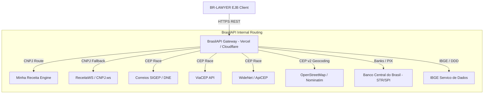
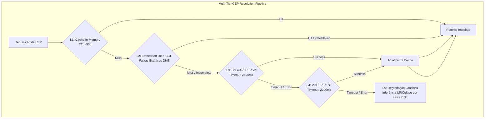

# BRAZILIAN REGISTRY INTELLIGENCE & DATA ENRICHMENT PROVIDER MATRIX
## Pesquisa Exaustiva de APIs Comunitárias, Projetos Open-Source, Validações Canônicas e Padrões de Resiliência para o BR-LAWYER

**Documento Técnico de Referência:** `docs/research/BRAZILIAN_REGISTRY_PROVIDER_MATRIX.md`  
**Escopo:** Mapeamento de Provedores de Dados Brasileiros (CNPJ, CPF, CEP, IBGE, Bancos, Feriados), Algoritmos Fonéticos em PT-BR, Validação Canônica Java e Arquitetura de Resiliência  
**Status:** Pesquisa Concluída & Especificação Técnica Aprovada  

---

### Sumário Executivo

O ecossistema jurídico e contábil brasileiro exige enriquecimento cadastral constante de partes (Polo Ativo, Passivo, Terceiros Interessados), advogados, testemunhas e sociedades empresárias. Este documento detalha a matriz comparativa de fontes de dados públicas, comunitárias e self-hostable, a arquitetura de resiliência recomendada para o **BR-LAWYER** (Java 17 / WildFly), algoritmos de deduplicação fonética adaptados para o Português do Brasil e conformidade de licenciamento de software livre (MIT, Apache 2.0, LGPL v2.1/v3, AGPL v3).

---

## 1. Análise Aprofundada da BrasilAPI (`brasilapi.com.br`)

### 1.1 Visão Geral e Arquitetura
A **BrasilAPI** (`github.com/BrasilAPI/BrasilAPI`) é um projeto open-source comunitário sob licença **MIT** que centraliza e padroniza o acesso a dados públicos brasileiros por meio de APIs REST modernas, com suporte a CORS nativo e baixa latência.

A arquitetura interna da BrasilAPI funciona como um **hub agregador e roteador de microsserviços**, executando consultas concorrentes (*racing* via `Promise.any` / fallbacks em cascata) sobre fontes governamentais e provedores legados.

### 1.2 Inventário Completo de Endpoints Relevantes para o BR-LAWYER

| Endpoint | Método | Descrição & Campos Principais | Fontes Subjacentes |
| :--- | :---: | :--- | :--- |
| `/api/cnpj/v1/{cnpj}` | `GET` | Consulta completa de CNPJ: Razão Social, Fantasia, CNAE Primário/Secundários, QSA (Sócios, Faixa Etária, CPF mascarado, Qualificação), Situação Cadastral, Regime Tributário (Simples Nacional / MEI), Capital Social, Endereço completo. | Minha Receita, ReceitaWS, Dumps RFB |
| `/api/cep/v1/{cep}` | `GET` | Consulta básica de CEP: `cep`, `state`, `city`, `neighborhood`, `street`, `service` (indica qual provedor venceu o race: correios, viacep, widenet). | Correios, ViaCEP, WideNet |
| `/api/cep/v2/{cep}` | `GET` | Consulta estendida de CEP com coordenadas geográficas: Campos do v1 + `location: { type: "Point", coordinates: { longitude, latitude } }`. | Provedores de CEP + Nominatim/OSM |
| `/api/banks/v1` | `GET` | Catálogo consolidado de instituições financeiras no Brasil: `ispb`, `name`, `code`, `fullName`. Essencial para cadastro de contas bancárias para depósitos judiciais e honorários. | Banco Central do Brasil (STR/SPI) |
| `/api/ibge/uf/v1` | `GET` | Lista de Unidades Federativas do Brasil com ID IBGE, sigla, nome e região. | IBGE API |
| `/api/ibge/municipios/v1/{uf}` | `GET` | Lista de municípios de uma UF com nomes e Códigos IBGE (7 dígitos). Vital para parametrização de comarcas e custas judiciais. | IBGE API |
| `/api/ddd/v1/{ddd}` | `GET` | Validação e mapeamento de código DDD para Estado (`state`) e lista de cidades abrangidas (`cities`). | Anatel / IBGE |
| `/api/feriados/v1/{ano}` | `GET` | Feriados nacionais oficiais (Lei nº 662/1949, Lei nº 10.607/2002, Lei nº 14.759/2023 - Dia da Consciência Negra). Retorna `date`, `name`, `type`. Crítico para cálculo de prazos processuais (CPC art. 219). | Legislação Federal Brasileira |
| `/api/taxas/v1` | `GET` | Taxas financeiras oficiais (SELIC, CDI, IPCA). Fundamental para atualização monetária de débitos e cálculos de liquidação de sentença. | Bacen / COPOM |

---

## 2. Análise Comparativa de Provedores de CEP

### 2.1 Visão Geral dos Provedores

### 2.2 Comparativo Detalhado de Provedores de CEP

| Atributo | ViaCEP (`viacep.com.br`) | BrasilAPI CEP (`brasilapi.com.br`) | OpenCEP (`opencep.com`) |
| :--- | :--- | :--- | :--- |
| **Endpoint Base** | `https://viacep.com.br/ws/{cep}/json/` | `https://brasilapi.com.br/api/cep/v2/{cep}` | `https://opencep.com/v1/{cep}` |
| **Campos de Retorno** | `cep`, `logradouro`, `complemento`, `bairro`, `localidade`, `uf`, `ibge`, `gia`, `ddd`, `siafi` | `cep`, `state`, `city`, `neighborhood`, `street`, `service`, `location` (lat/long) | `cep`, `logradouro`, `complemento`, `bairro`, `localidade`, `uf`, `ibge` |
| **Geolocalização (Lat/Long)** | ❌ Não | ✅ Sim (v2 via OSM Nominatim) | ❌ Não |
| **Código IBGE do Município** | ✅ Sim (`ibge`) | ❌ Não direto | ✅ Sim (`ibge`) |
| **Código SIAFI / GIA** | ✅ Sim (exclusivo) | ❌ Não | ❌ Não |
| **Mecanismo de Resiliência** | Monolítico dedicado | Race multi-provedor (Correios/ViaCEP/WideNet) | Réplica de dados abertos DNE |
| **Política de Bloqueio** | Bloqueio de IP se tráfego massivo (>300 req/min) | HTTP 429 por Cloudflare WAF sob abuso | Rate limit comunitário |
| **Licença / Acesso** | Gratuito | MIT / Open Source | MIT / Open Source |

---

## 3. Projetos Open-Source de Referência e Motores Self-Hostable

### 3.1 Minha Receita (`github.com/cuducos/minha-receita`)
O **Minha Receita** é a principal referência open-source em **Go** para indexação e consulta autônoma de CNPJs a partir dos dumps mensais de dados abertos da Receita Federal do Brasil.

- **Dumps RFB:** `EMPRECSV`, `ESTABELE`, `SOCIOCSV`, `SIMPLES`, `CNAECSV`, `MUNICCSV`.
- **Estratégia de Integração:** O BR-LAWYER pode consultar uma instância local ou remota do Minha Receita via HTTP REST padrão (`http://localhost:8000/{cnpj}`) ou consumir o endpoint público da BrasilAPI.

---

## 4. Algoritmos de Deduplicação Fonética e Similaridade Textual em Português

### 4.1 Normalização Textual e Stopwords Empresariais
Para evitar falso-positivos em conflitos de interesse e duplicidades cadastrais, o BR-LAWYER implementa:
1. Normalização Unicode NFD com remoção de diacríticos.
2. Remoção de stopwords societárias padronizadas (`LTDA`, `S.A.`, `EIRELI`, `ME`, `EPP`, `MEI`, `CIA`, `HOLDING`, `PARTICIPACOES`, `SERVICOS`, `COMERCIO`).
3. Algoritmo de codificação fonética em português (**Metaphone-PT**).
4. Cálculo de similaridade híbrida ponderada com **Jaro-Winkler** e distância de edição.

$$\text{Score}_{\text{Total}} = 0.50 \times \text{JaroWinkler}(\text{Nome}_1, \text{Nome}_2) + 0.30 \times \text{TrigramSimilarity}(\text{Nome}_1, \text{Nome}_2) + 0.20 \times \delta(\text{Metaphone}_1, \text{Metaphone}_2)$$

---

## 5. Padrões de Resiliência e Integração HTTP

As chamadas a APIs governamentais e comunitárias gratuitas estão sujeitas a variações de latência. O BR-LAWYER adota:
- **Circuit Breaker:** Aberto após 3 falhas consecutivas, com cooldown de 30s a 60s e transição para Half-Open.
- **Exponential Backoff com Jitter:** Evita rajadas repetitivas sincronizadas.
- **Multi-Tier Cache:** TTL de 24h para CNPJ/QSA, 90 dias para CEP/Endereços, e 365 dias para catálogo de bancos/IBGE.
- **Fallback Automático:** CEP (BrasilAPI $\rightarrow$ ViaCEP $\rightarrow$ Local IBGE); CNPJ (BrasilAPI $\rightarrow$ SERPRO / Sidecar local).

---

## 6. Matriz Comparativa Consolidada de Provedores

| Provedor / Projeto | supportsCpf | supportsCnpj | supportsQsa | supportsAddress | supportsCnae | requiresCredentials | freeTier | selfHostable | Decisão BR-LAWYER |
| :--- | :---: | :---: | :---: | :---: | :---: | :---: | :---: | :---: | :---: |
| **BrasilAPI** | ❌ | ✅ | ✅ | ✅ | ✅ | ❌ Não | ✅ 100% | ⚠️ Requer infra | `PRIMARY_ONLINE` |
| **ViaCEP** | ❌ | ❌ | ❌ | ✅ | ❌ | ❌ Não | ✅ 100% | ❌ Não | `FALLBACK_CEP` |
| **Minha Receita** | ❌ | ✅ | ✅ | ✅ | ✅ | ❌ Não | ✅ 100% | ✅ Sim (Go/Docker)| `SIDECAR_ENTERPRISE` |
| **SERPRO CPF V3** | ✅ | ❌ | ❌ | ❌ | ❌ | ✅ Sim (OAuth2) | ❌ Pago | ❌ Não | `OFFICIAL_CPF_PROVIDER`|
| **SERPRO CNPJ** | ❌ | ✅ | ✅ | ✅ | ✅ | ✅ Sim (OAuth2) | ❌ Pago | ❌ Não | `OFFICIAL_CNPJ_FALLBACK`|
| **CNA / OAB SPI** | ❌ | ❌ | ❌ | ❌ | ❌ | ⚠️ Conforme SPI | ✅ Mock/SPI | ✅ Sim | `SPI_PLUGGABLE` |
| **IBGE Localidades** | ❌ | ❌ | ❌ | ✅ | ❌ | ❌ Não | ✅ 100% | ✅ Sim (Tabela) | `GEOGRAPHIC_PROVIDER` |
| **BACEN SPB/PIX** | ❌ | ❌ | ❌ | ❌ | ❌ | ❌ Não | ✅ 100% | ✅ Sim (Tabela) | `BANKING_PROVIDER` |
| **Mock Provider** | ✅ | ✅ | ✅ | ✅ | ✅ | ❌ Não | ✅ 100% | ✅ Sim | `TEST_AND_OFFLINE` |
